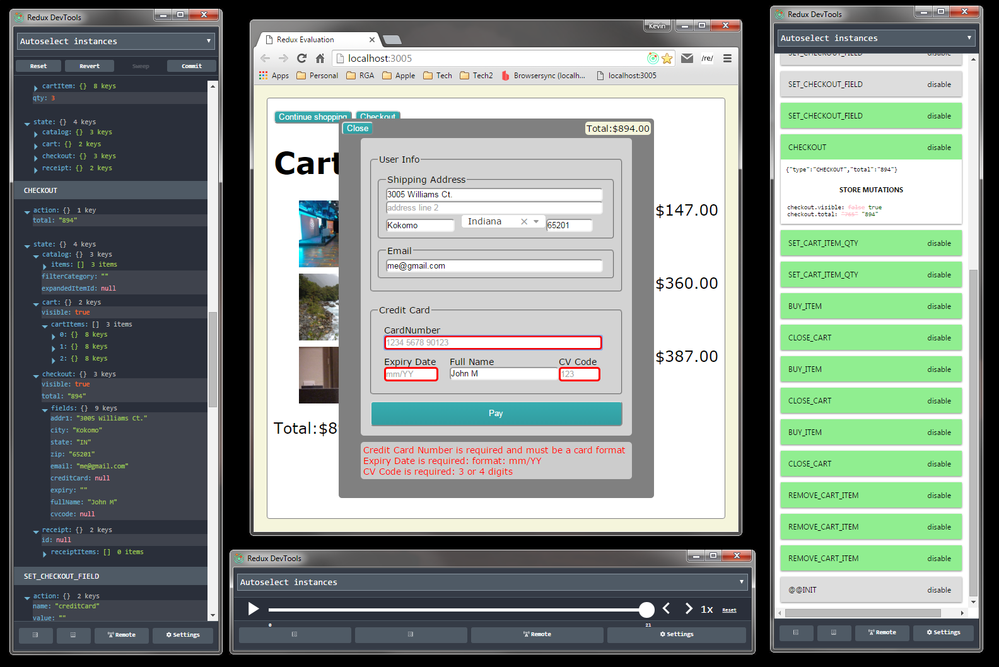

# ReactReduxShoppingCart

This is a Redux version of the CodeWinds University React Shopping
Cart Training Course (Jeff Barczewski http://codewinds.com/).

This is a significant refactor for this app, maintaining application
state through the Redux framework (a popular Flux implementation).

## App State

Our Shopping Cart app maintains a single persistent state, employing
the Redux pattern of Actions and Reducers.  In essence these are
business events, that drive our apps state transition.


#### State Specification

The complete specification of our app state is shown here.  Notice
that structural depth is maintained to emphasize ownership.

```javascript
{
  catalog: {               // our catalog of items which can be purchased
    items:          [],    // items list [ { id: <int>, name: <string>, price: <int>, img: <string>, category: <string>, desc: <string>, details: <string> ]
    filterCategory: null,  // item filter category <String> "" for show all
    itemExpanded:   null,  // item to expand {...item} null for no expansion
  },

  cart: {             // our shopping cart
    visible:   false, // is cart dialog visible <boolean>
    cartItems: [],    // shopping cart item list [ { ...item, qty: <int> } ]
  },

  checkout: {       // checkout data (for purchase)
??  visible: false, // is checkout dialog visible <boolean> ??? was checkoutOpen
??  total:   null,  // total amount being checked out <???>  ??? WAS: total

    // NOTE: These checkout.fields MUST MATCH the <Checkout> form field names
??  fields: {
      addr1:      "", // <string>
      addr2:      "", // <string>
      city:       "", // <string>
      state:      "", // <string>
      zip:        "", // <string>
      email:      "", // <string>
      creditCard: "", // <string>
      expiry:     "", // <string>
      fullName:   "", // <string>
      cvcode:     "", // <string>
    }
  },

  receipt: {         // our shopping receipt
??  id:        null, // receipt id <???> ??? was receiptId
??  cartItems: [],   // receipt item list [ { ...cartItems } ] ??? was receiptItems
  }

}
```

#### State Transition

Our state definition/transition is maintained by a series of actions
that are interpreted by a graph of reducers.  This in
conjunction with the Redux dispatcher, provides a complete solution
for maintaining our state.

As an example, let's say you have an item who's detail should be
expanded in our GUI.  You simply locate the desired action
in [src/state/actionCreators.js](./src/state/actionCreators.js),
and publish it with the Redux dispatch mechanism.  This task is
accomplished in one line of code:

```javascript
import * as AC from 'src/state/actionCreators' // AC: Action Creators
...
  dispatch(AC.toggleItemDetail(item))
```


#### State Code

The business logic that maintains the state definition/transition can
be found in [src/state/](./src/state/).  Please note that the
structure of the reducers match our overall state.

```
src/
  state/
    actionTypes.js .............. all action types (defined constants)

    actionCreators.js ........... all action creators
    actionCreators.kmocha.js

    appState.js ................. appState top-level reducer (a Redux combineReducer)

    catalog.js .................. appState.catalog reducer (a Redux combineReducer)

    catalog.items.js ............ appState.catalog.items reducer
    catalog.items.kmocha.js

    catalog.filterCategory.js ... appState.catalog.filterCategory reducer
    catalog.filterCategorykmocha..js

    catalog.itemExpanded.js ..... appState.catalog.itemExpanded reducer
    catalog.itemExpanded.kmocha.js

    cart.js ..................... appState.cart reducer (a Redux combineReducer)

    ... etc.
```


#### State Promotion

The app state is a Redux store, and is promoted through the
react-redux `<Provider>` component (see the bootstrap process in
[src/browser.jsx](./src/browser.jsx)).  This makes the app state available to any
component that monitors the Redux store (via the Redux-Redux connect()
function).  Under the covers, this bit of magic is accomplished
through the React Context feature.


## Simplified UI Components

The UI components were simplified, in the sense that the large set of
detailed parameters are now minimized.  In many cases component
parameters are completely eliminated.

??? NEW START

Prior to this refactor state and functionality filtered down from the
top-level App component, by passing component properties.  The reason
for this was that only the App component had access to the top-level
state and the rudimentary setState() transformation mechnism.

This property chain was very tedious.  You may have a 3rd or 4th level
component that required a callback defined in the root App.  This made
the property chain very combersome, as all components in the chain had
to be aware of this ... in many cases intermediate components merely
passing callbacks through to the next level.

In our new approach, any component can have access to the app state.
In addition, any component can dispatch well-defined business actions
that formally alter the app state.

We still utilize component properties internally (both data and
behavior) to keep our React components simple, it's just that these
properties are dynamically injected at the component level.  This can
roughly be thought of as a type of Dependency Injection.

In essance (where needed) we wrap an internal private component with a
publicly promoted component that:
 - has access to our Redux appState and dispatch()
 - and dynamically injects the needed properties to the internal component

These components can still have properties passed to them from their
parent component, but this is used for finer grained control (not
based on state), and is somewhat rare.  As an example <ItemRow> has to
be told what item it is rendering (through the "item" property).  This
can't be defined from state because there are many items, rather the
parent <Catalog> iterates through all items generating an <ItemRow
item={item}/> for each.

In summary, if a component property is fundamentaly based on state, it
can be handled internally. For other non-state characteristics, a
property can be passed from parent to child.

What makes this possible is two things:
 - The redux mechnism to be able to connect to our state and it's dispatcher.
 - The fact that we have well-defined business actions that formally transition our state

The end result is the code is much easier to follow.  Parameter
passing is minimized.  As a result "cause and effect" is more
localized to a component ... you don't have to follow a long chain
back to the source.  In addition, you no longer have a mish mash of
business functions thrown together at the App level.  The logic is
much more distributed (if you will).

?? discuss some code examples As an example, in the old logic, the App
component had a buyFunction() that had to be passed from <App> through
<Catalog> through <ItemRow> where the Buy button exists.  Under the
new refactored code, the App.buyFunction() is replaced with a ???
Action, that can be directly dispatched from the <ItemRow> ... no
fuss, no muss.

??? look at some code where $ is post-fixed to an internal class
    ?? the internal class is written as normal, with properties passed in
    ?? the public wrapper class uses the react-redux connect() to inject
       needed properties using appState and dispatch()


??? NEW END


Prior to this refactor, many components required a very large number
of parameters, communicating both data and behavioral callbacks.  It
was very much a top-down approach, where the top-level component was
all-knowing ... having intimate knowledge of lower-level 
components.  In some cases, parameters had to be passed from the
top-level through the component chain, simply because it may be needed
by a grandchild component.

Where needed, a component is now divided into two separate components
that work in conjunction with one another.

 - A controlling component, that is bound to the application state,
   and communicates both data and behavior to the presentation
   component (through parameters).

   A controller component "wraps" the presentation component, and can
   be roughly thought of as a type of Dependency Injector.

   This is what Redux refers to as a containing component, because it
   contains a presentation component.

   Most behavioral aspects are related to state changes, and can be
   resolved at this level due to the well-designed event processors
   that transition state (Redux's dispatch() of actions).

   Typically, controlling components have very few parameters.  If they
   do it is at a higher-level of abstraction.

 - A presentation component, that is solely focused on layout and presentation.

   A presentation component defers behavioral aspects back to it's
   invoker (the controlling component).

   Presentation components are "wrapped" by a controlling components.

   Presentation components typically have a number of parameters.  The
   difference is, these parameters are typically in a short DOM chain
   ... originating in the controlling component.
   
As an example of this, look at the CatalogCtrl component
([src/comp/catalog-ctrl.js](./src/comp/catalog-ctrl.js)). 
The CatalogCtrl "wraps" the Catalog component
([src/comp/catalog.jsx](./src/comp/catalog.jsx))
a presentation component.

 - CatalogCtrl:
   * wraps the Catalog (what Redux calls a container component)
   * takes minimal (or no) parameters
     - parameters at this level are higher-level controls
   * connects to the app state
     * transferring state to the wrapped Catalog (via properties)
     * driving business functionality that ultimately causes our state to transition
       - by dispatching appropriate actions
 - Catalog:
   * is a "wrapped" component of Catalog (what Redux calls ??? Presentation Components).
   * it primary concern is presentation
   * accepting a number of parameters
     - both data - driving presentation content
     - and callback functions - driving state change

The characteristics of this Catalog example are repeated throughout our
app.


## Time Travel

Because our state is immutable, each transition can optionally be
monitored, providing things like undo/redo etc.  I would highly
recommend installing the Redux DevTools Chrome Extension (the app has
been tooled to automatically hook to this extension when present).
With this, you can monitor state transitions through the following
means:

- Log Monitor: showing each Action and the new resulting state
- Diff Monitor: showing each Action with a DIFF of the old/new state
- Slider Monitor: allowing you to move back and forth in time
- Chart Monitor: showing your state in a graphical tree



?? update to be the real image


## Conclusion

Within a React app, I would strongly suggest utilizing one of the Flux
utilities.  The most popular and well-documented Flux library is
Redux.

My experience here is that applying this framework not only simplified
the code, but it brought order to what otherwise could very quickly
turn into the "Wild Wild West".

I disagree with the sentiment that says: "Don't use Flux till you need
it" ([Pete Hunt's React
HowTo](https://github.com/petehunt/react-howto)).

You can say the for "simple apps" it is an overkill, but when was the
last time you wrote a "simple app"?  The shopping cart app is "pretty
simple" (i.e. it is a training exercise), and yet in my estimation we
greatly benefited from the Redux injection!

The real development effort is in setting up the actions and reducers.
While this may be somewhat tedious, it builds on a solid foundation
that promotes consistency, which allows it to scale very well.  It
also documents the total set of business functionality that can be
easily unit tested.

Once your actions and reducers are in place, invoking the business
functionality is a breeze (it's simply a matter of dispatching an
action).
