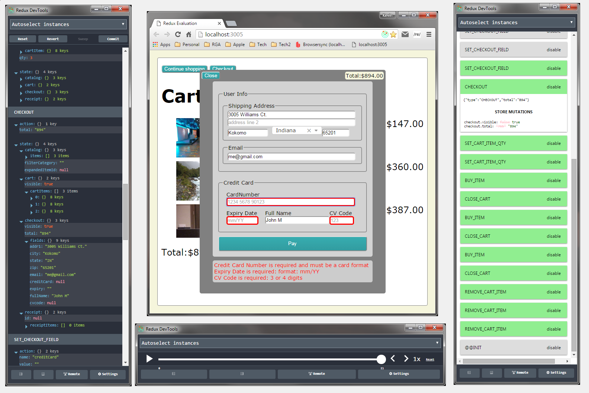

# ReactReduxShoppingCart

This is a Redux version of the CodeWinds University React Shopping
Cart Training Course (Jeff Barczewski http://codewinds.com/).

This is a significant refactor for this app, maintaining application
state through the Redux framework (a popular Flux implementation).

## App State

The app maintains a single persistant state, employing the Redux
pattern of Actions and Reducers.  In essance these are business
events, that drive our apps state transition.

??? describe the structure of src/state

The complete specification of our app state is documented
[here](src/state/README.md "Shopping Cart App State").

The app state is a Redux store, and is promoted through the
react-redux <Provider> component (see the bootstrap process in
src/browser.jsx).  This makes the app state available to any component
that ???.  This is a bit of majic, however under the covers it
utilizes the React Context feature.

## Simplified UI Components

The UI components are simplified, in the sense that the large set of
detailed parameters are minimized ... in many cases eliminated all
together.

Each component is divided into two components ... a wrapper and a contained.

Prior to this refactor, there were cases where a parameter
had to be passed through the component chain, simply because it was
potentially required by a grandchild component.

through ???, eliminating the need to
pass a long list of parameters from the top-down.  You can almost
consider this a type of Dependancy Injection of both data and business
logic.  As an example of this, look at the Catalog component
(src/component/catalog.jsx).  This is a "wrapper" component of
Catalog? (src/component/catalog?.jsx).

 - Catalog:
   * is a wrapper to Catalog? (what Redux calls ???).
   * takes minimal (or no) parameters
     - parameters at this level are higher-level controls
   * connects to the app state
   * that transfers app state into Catalog? properties
   * drives business functionality that ultimatly causes our state to transition
     - by dispatching appropriate actions
 - Catalog?:
   * is a "wrapped" component of Catalog (what Redux calls ???).
   * it primary concern is presentation
   * accepting a number of parameters
     - both data - driving presentation content
     - and callback functions - driving 

The characteritics of this example Catalog are repeated throughout our various components

## Time Travel

Because our state is immutable, each transition can optionally be
monitored, providing things like undo/redo etc.  I would highly
recommend installing the Redux DevTools Chrome Extension (the app has
been tooled to automatically hook to this extension when present).
With this, you can monitor state transitions through the following
means:

- Log Monitor: showing each Action and the new resulting state
- Diff Monitor: showing each Action with a DIFF of the old/new state
- Slider Monitor: allowing you to move back and forth in time
- Chart Monitor: showing your state in a graphical tree

?? inject this image

## Conclusion

Within a React app, I would strongly suggest utilizing one of the Flux
utilities.  The most popular and well-documented Flux library is
Redux.

My experience here is that applying this framework not only simplified
the code, but it brought order to what otherwise could very quickly
turn into the "Wild Wild West".

I strongly dissagree with the mindset of "Don't use Flux till you need
it" ([Pete Hunt's React HowTo](https://github.com/petehunt/react-howto)).

Sure for "simple apps" it may be an overkill, but when was the last
time you wrote a "simple app"?  The shopping cart app is "pretty
simple" (as it is a training exercise), and yet in my estimation we
greatly benefited from this Redux injection!
